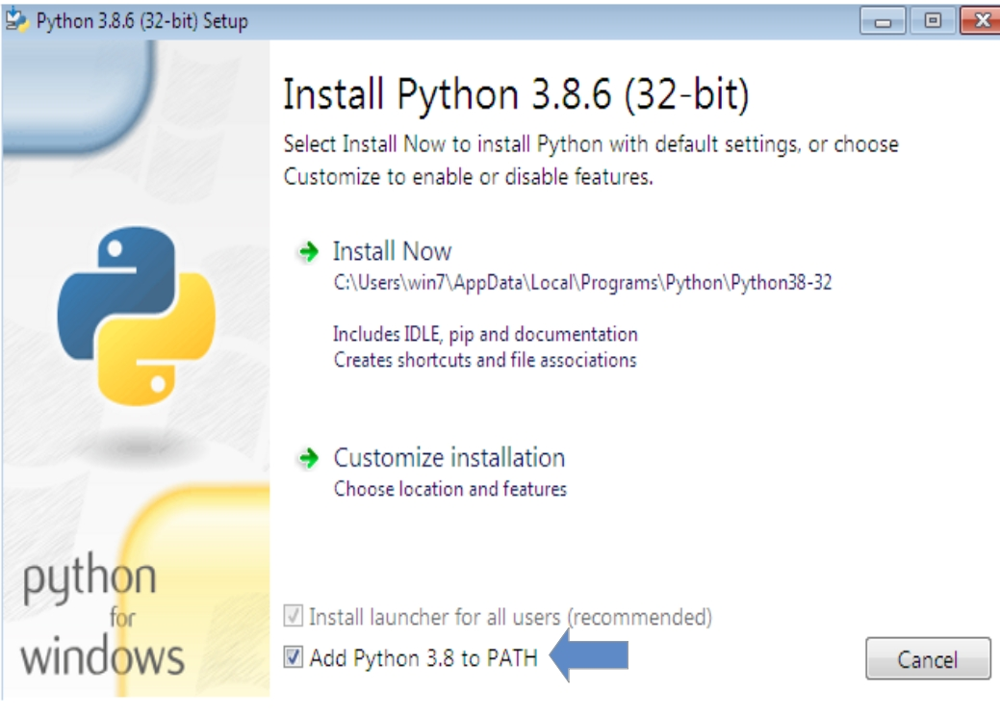
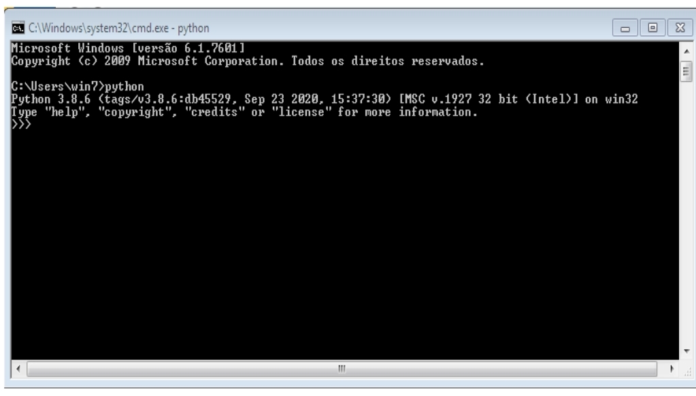
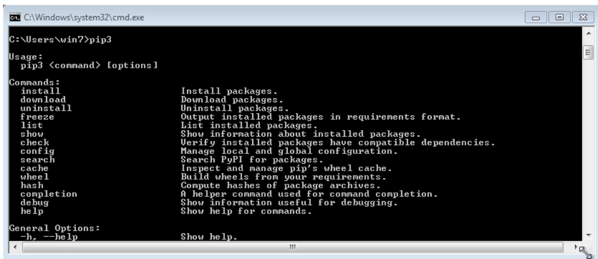
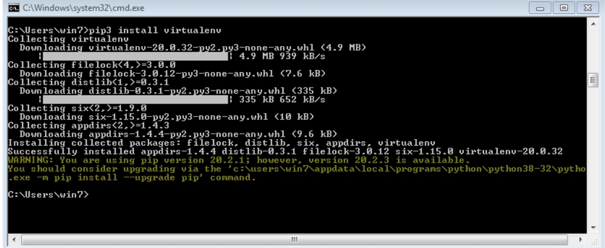
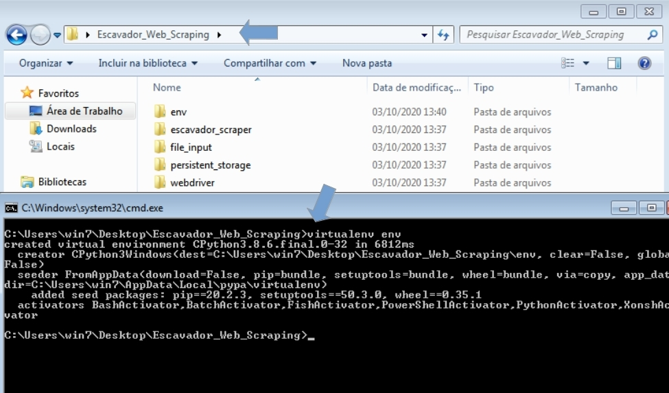
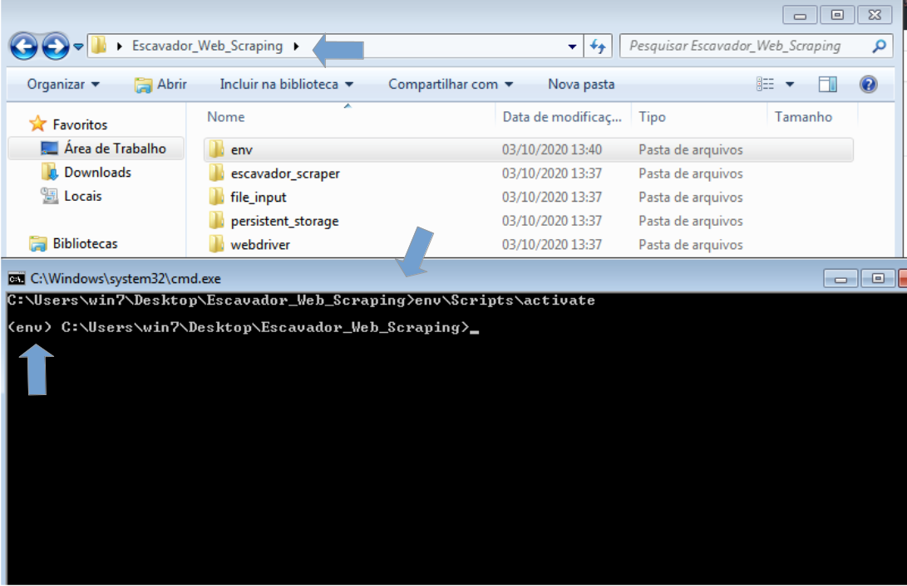
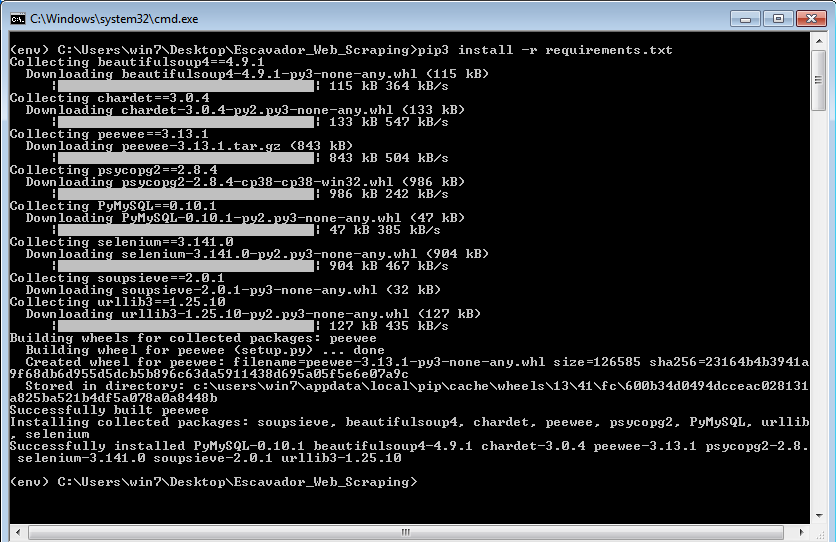

# Escavador_Web_Scraping
Escavador Web Scraping

## <a name="prototipos"></a> Sumário
+ [1.2. Instalação e Configuração do Ambiente Windows](#1.2.)
+ [1.2.1. Instalação do Python 3](#1.2.1.)
+ [1.2.2. Instalação do gerenciador de pacotes (pip3)](#1.2.2.)
+ [1.2.3. Instalação do Gerenciador de Ambiente Virtual (virtualenv)](#1.2.3.)
+ [1.2.4. Criação do Ambiente Virtual](#1.2.4.)
+ [1.2.5. Ativação do Ambiente Virtual](#1.2.5.)
+ [1.2.6. Instalação dos pacotes dependetes](#1.2.6.)
+ [1.2.7. Servidor WebDriver remoto (Docker)](#1.2.7.)

## <a name="1.2."></a> 1.2. Instalação e Configuração do Ambiente Windows


### <a name="1.2.1."></a> 1.2.1. Instalação do Python 3


Link do site de donwload: https://www.python.org/downloads <br>

No programa instalador do Python certifique-se que tenha baixado a versão 3 do Pyhton verificando o nome presente no título do instalador.
Antes de instalar marque a opção 'Add Python to PATH' (ou 'Adicionar Python para PATH'), como mostra a Fihura 1 a seguir, para ter acesso ao Python por meio de linha de comando, ou seja, Prompt de comando. Para iniciar a instalação click no botão 'Install now' (ou 'Instalar agora').

<figure>
	
	<figcaption>Figura 1 - Instalador do Python</figcaption>
</figure>

Para verificar se o Python está corretamente instalado basta acessar o Prompt de Comando (cmd) do sistema Windows e digitar o comando `python`, a mensagem retornada deve ser semelhante a apresentada na Figura 2.

<figure>
	
	<figcaption>Figura 2 - Prompt de Comando acessando Python</figcaption>
</figure>


### <a name="1.2.2."></a> 1.2.2. Instalação do gerenciador de pacotes (pip3)

Para verificar se o Gerenciado de Pacotes do Python pip3 está corretamente instalado basta acessar o Prompt de Comando (cmd) do sistema Windows e digitar o comando `pip3`, a mensagem retornada deve ser semelhante a apresentada na Figura 3.

<figure>
	
	<figcaption>Figura 3 - Prompt de Comando acessando pip3</figcaption>
</figure>

### <a name="1.2.3."></a> 1.2.3. Instalação do Gerenciador de Ambiente Virtual (virtualenv)

Digite o comando a seguir no Prompt de comando. O resultado esperado está na Figura 4.

```
pip3 install virtualenv

```

<figure>
	
	<figcaption>Figura 4 - Prompt de Comando instalando virtualenv com pip3</figcaption>
</figure>

### <a name="1.2.4."></a> 1.2.4. Criação do Ambiente Virtual

Digite o comando a seguir no Prompt de comando. O resultado esperado está na Figura 5.

```
virtualenv env
```

<figure>
	
	<figcaption>Figura 5 - Prompt de Comando cria env</figcaption>
</figure>

Obs.: É preciso abrir o terminal dentro da pasta do programa. <br>
Só é necessário executar esse comando se a pasta  env não existir dentro da pasta do programa.

### <a name="1.2.5."></a> 1.2.5. Ativação do Ambiente Virtual

Digite o comando a seguir no Prompt de comando. O resultado esperado está na Figura 6.

```
env\Scripts\activate
```

<figure>
	
	<figcaption>Figura 6 - Prompt de Comando ativação env</figcaption>
</figure>

Obs.: É preciso abrir o terminal dentro da pasta do programa, mas fora da pasta env. <br>
O ambiente está ativado quando é apresentado `(env)`.

### <a name="1.2.6."></a> 1.2.6. Instalação dos pacotes dependetes

Digite o comando a seguir no Prompt de comando. O resultado esperado está na Figura 7.

```
pip3 install -r requirements.txt
```

<figure>
	
	<figcaption>Figura 7 - Prompt de Comando instalação das bibliotecas necessárias</figcaption>
</figure>


Obs.: É preciso que o terminal esteja aberto na pasta do programa e o ambiente esteja ativado. <br>


### <a name="1.2.7."></a> 1.2.7. Servidor WebDriver remoto (Docker)

Instale o Docker no Windows: https://docs.docker.com/docker-for-windows/install

Entre no diretório docker, do programa Web Scraping, onde está localizado o `Dockerfile` e `docker-compose.yaml`, execute o comando a seguir: 


```
docker-compose up -d

```

Obs.: Se não funcionar, execute o comando como administrador do Windows.
