# Escavador_Web_Scraping
Escavador Web Scraping

## <a name="prototipos"></a> Sumário
+ [2.2. Manual de uso do Sistema Windows](#2.2.)
+ [2.2.1. Criação do Ambiente Virtual](#2.2.1.)
+ [2.2.2. Ativação do Ambiente Virtual](#2.2.2.)
+ [2.2.3. Adiciona variável de ambiente do banco de dados](#2.2.3.)
+ [2.2.4. Execução do programa Web Scraping](#2.2.4.)
+ [2.2.4.1. Funcionalidade cria base](#2.2.4.1.)
+ [2.2.4.2. Funcionalidade apaga base](#2.2.4.2.)
+ [2.2.4.3. Funcionalidade carrega planilha](#2.2.4.3.)
+ [2.2.4.4. Funcionalidade login para coleta de dados](#2.2.4.4.)
+ [2.2.4.5. Funcionalidade coleta de dados](#2.2.4.5.)
+ [2.2.4.6. Funcionalidade logout da coleta de dados](#2.2.4.6.)
+ [2.2.4.7. Funcionalidade marcação de dados](#2.2.4.7.)
+ [2.2.4.8. Funcionalidade desfazer marcação de dados](#2.2.4.8.)
+ [2.2.5. Arquivo de configuração do Web Scraping](#2.2.5.)


## <a name="2.2."></a> 2.2. Manual de uso do Sistema Windows


### <a name="2.2.1."></a> 2.2.1. Criação do Ambiente Virtual

Digite o comando a seguir no Prompt de comando. O resultado esperado está na Figura 1.

```
virtualenv env
```

<figure>
	
	<figcaption>Figura 1 - Prompt de Comando cria env</figcaption>
</figure>

Obs.: É preciso abrir o terminal dentro da pasta do programa. <br>
Só é necessário executar esse comando se a pasta  env não existir dentro da pasta do programa.

### <a name="2.2.2."></a> 2.2.2. Ativação do Ambiente Virtual
Digite o comando a seguir no Prompt de comando. O resultado esperado está na Figura 2.

```
env\Scripts\activate
```

<figure>
	
	<figcaption>Figura 2 - Prompt de Comando ativação env</figcaption>
</figure>

Obs.: É preciso abrir o terminal dentro da pasta do programa, mas fora da pasta env. <br>
O ambiente está ativado quando é apresentado `(env)`.

### <a name="2.2.3."></a> 2.2.3. Adiciona variável de ambiente do banco de dados

Digite o comando a seguir no Prompt de comando. O resultado esperado está na Figura 3.

```
set HOST=xxx
set DATABASE=xxx
set USER=xxx
set PASSWORD=xxx
set PORT=xxx
```

<figure>
	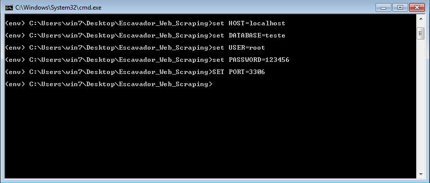
	<figcaption>Figura 3 - Prompt de Comando define variável de ambiente</figcaption>
</figure>

Obs.: HOST, DATABASE, USER, PASSWORD e PORT são variáveis de ambiente para a conexão com o Banco de Dados. <br>
É preciso que o terminal esteja aberto na pasta do programa e o ambiente esteja ativado. 

### <a name="2.2.4."></a> 2.2.4. Execução do programa Web Scraping

Digite o comando a seguir no Prompt de comando para conhecer as funcionalidades do programa. O resultado esperado está na Figura 4, uma lista de argumentos que devem ser informados para ativar cada funcionalidade.

```
python main.py ajuda

```

<figure>
	
	<figcaption>Figura 4 - Funcionalidades de ajuda</figcaption>
</figure>

Obs.: O programa só vai funcionar se: o ambiente virtual estiver ativo, os pacotes dependetes do programa forem instalados, e as variáveis de ambiente forem definidas para uma banco de dados existente.  

### <a name="2.2.4.1."></a> 2.2.4.1. Funcionalidade cria base


Digite o comando a seguir no Prompt de comando para criar as tabelas do banco de dados. O resultado esperado está na Figura 5, uma mensagem informando o sucesso na execução dessa funcionalidade.

```
python main.py cria_base

```

<figure>
	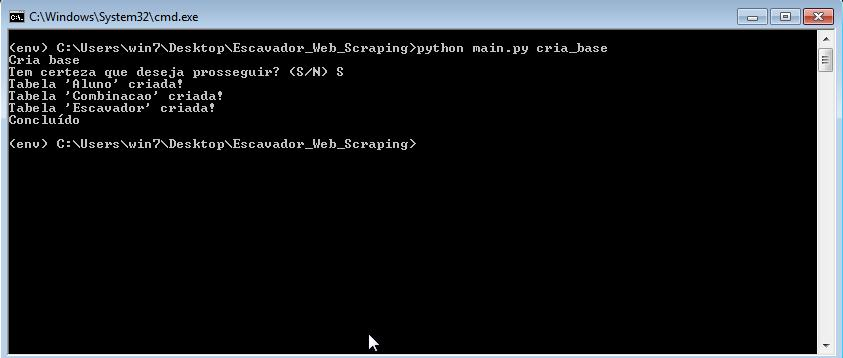
	<figcaption>Figura 5 - Funcionalidade cria base</figcaption>
</figure>


### <a name="2.2.4.2."></a> 2.2.4.2. Funcionalidade apaga base


Digite o comando a seguir no Prompt de comando para apagar as tabelas do banco de dados. O resultado esperado está na Figura 6, uma mensagem informando o sucesso na execução dessa funcionalidade.

```
python main.py apaga_base

```

<figure>
	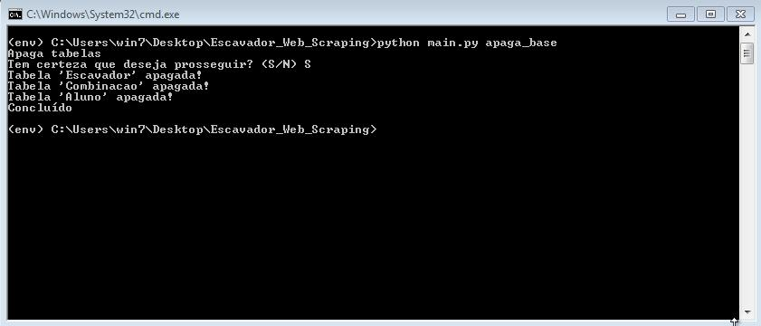
	<figcaption>Figura 6 - Funcionalidade apaga base</figcaption>
</figure>


### <a name="2.2.4.3."></a> 2.2.4.3. Funcionalidade carrega planilha

Digite o comando a seguir no Prompt de comando para carregar a planilha CSV com os dados do aluno e salvar no banco de dados. O resultado esperado está na Figura 7.

```
python main.py carrega_planilha

```

<figure>
	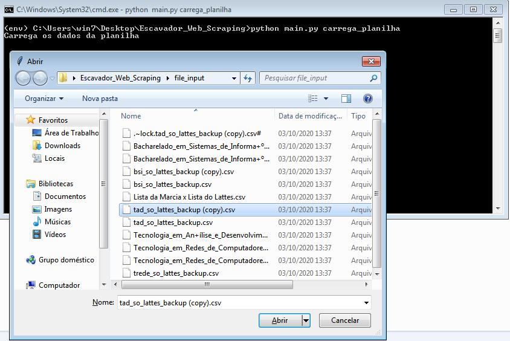
	<figcaption>Figura 7 - Funcionalidade carrega planilha </figcaption>
</figure>


A Figura 8 apresenta o arquivo JSON  de configuração, nomeado `configuracao.json`, que define o caminho do arquivo da planilha através de um texto informado no atributo 'dir_planilha'.

<figure>
	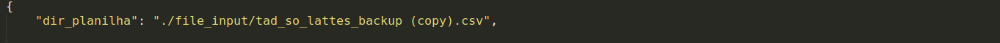
	<figcaption>Figura 8 - Configuração de carrega planilha </figcaption>
</figure>

O formato da planilha que o programa espera como entrada é apresentado na Figura 9, ela deve ter nesta ordem as colunas: Matrícula, Nome de Aluno, Data de Nascimento, Nome do curso, Ano de Início, Período de Início, Ano de fim, Período de fim e o Sexo do aluno. Obs.: Espera-se que a planilha tenha o cabeçalho apresentado na imagem a seguir, tenha a codificação UTF-8 e o delimitador seja ou uma vírgula ou um ponto e vírgula.

<figure>
	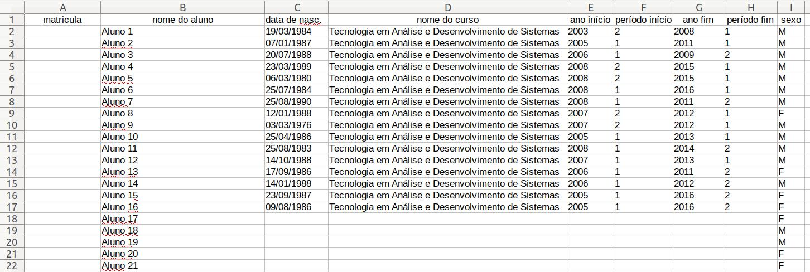
	<figcaption>Figura 9 - Formato da planilha </figcaption>
</figure>


### <a name="2.2.4.4."></a> 2.2.4.4. Funcionalidade login para coleta de dados 

Digite o comando a seguir no Prompt de comando para realizar o login no site de busca. A marcação `<user>` e `<password>` devem ser substituidas pelas credenciais de login existente para ter acesso a uma conta no site. O resultado esperado está na Figura 10, uma mensagem informando o sucesso na execução dessa funcionalidade.

```
python main.py coleta_dados login <user> <password>

```

<figure>
	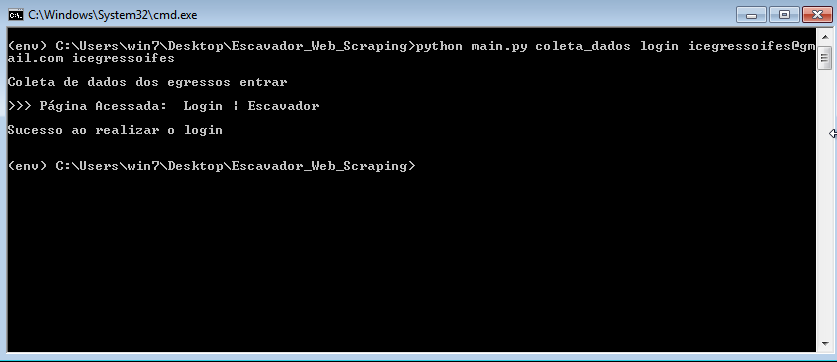
	<figcaption>Figura 10 - Funcionalidade de login para coleta de dados </figcaption>
</figure>

### <a name="2.2.4.5."></a> 2.2.4.5. Funcionalidade coleta de dados


Após realizar o login digite o comando a seguir no Prompt de comando para iniciar a coleta das páginas de perfil. O resultado esperado está na Figura 11, uma mensagem informando o início da execução dessa funcionalidade.

```
python main.py coleta_dados

```

<figure>
	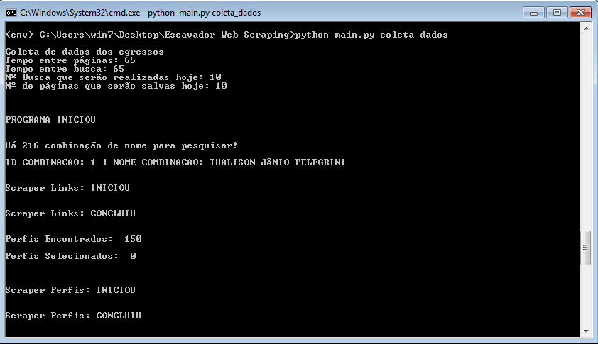
	<figcaption>Figura 11 - Funcionalidade coleta de dados </figcaption>
</figure>


Antes de executar a funcionalidade coleta de dados certifique-se que atributo `config_coleta` do JSON nomeado `configuracao.json` esteja configurado com os valores de:

* `tempo_entre_pagina`: o valor desta variável representa o tempo em segundos que será esperado a mais entre a visita de uma página perfil e outra visita.

* `tempo_entre_busca`: o valor desta variável representa o tempo em segundos que será esperado a mais entre uma pesquisa de combinação de nome e outra pesquisa.

* `pesquisar_hoje`: o valor desta variável representa o máximo de pesquisas  de combinação de nome que poderão ser realizadas na data atual da execução do sistema.

* `encontrado_hoje`: o valor desta variável representa o máximo de páginas de perfil que poderão ser salvas na data atual da execução do sistema.

A figura 12 apresenta um exemplo de valores de configuração do atributo `config_coleta` do JSON `configuracao.json`.


<figure>
	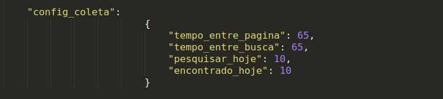
	<figcaption>Figura 12 - Configuração de coleta de dados </figcaption>
</figure>


### <a name="2.2.4.6."></a> 2.2.4.6. Funcionalidade logout da coleta de dados

Digite o comando a seguir no Prompt de comando para realizar o logout no site de busca. O resultado esperado está na Figura 13.

```
python main.py coleta_dados logout
```

<figure>
	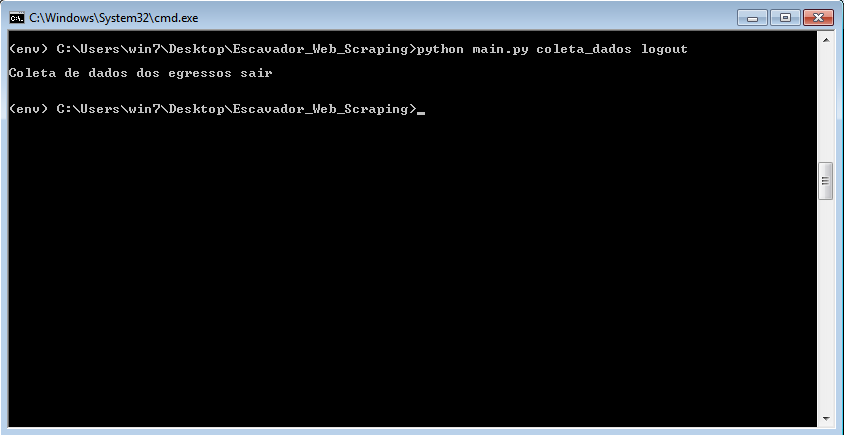
	<figcaption>Figura 13 - Funcionalidade logout da coleta de dados </figcaption>
</figure>


### <a name="2.2.4.7."></a> 2.2.4.7. Funcionalidade marcação de dados

Digite o comando a seguir no Prompt de comando para realizar a marcação dos dados das páginas coletadas de modo a identificar se a página pertence ou não ao egresso. O resultado esperado está na Figura 14, uma mensagem informando o sucesso na execução dessa funcionalidade.

```
python main.py coleta_dados marca_dados
```

<figure>
	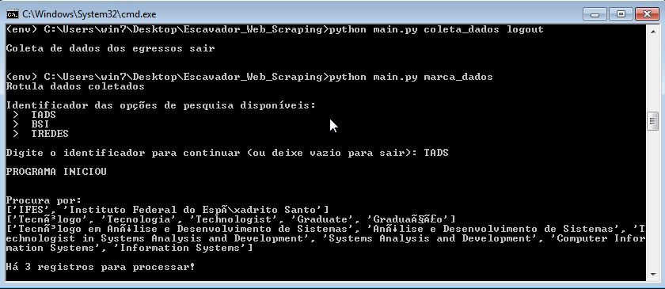
	<figcaption>Figura 14 - Funcionalidade marca dados </figcaption>
</figure>

Antes de executar a funcionalidade marcação de dados certifique-se que atributo `config_marcacao` do JSON nomeado `configuracao.json` esteja configurado com os valores dos cursos. Como apresentado na Figura 15, há uma lista com informação de cada curso. As informações dos cursos ficam agrupadas em chaves (`{...}`). Cada grupo tem os atributos: `identificador`, `nome_instituicao`, `grau_academico` e `nome_curso`. Veja a seguir o que cada um representa:

* `identificador`: texto que define o identificador de um determinado curso. Este nome será solicitado ao usuário para definir quais informações serão usadas no processo de marcação.

* `nome_instituicao`: Lista que contém as possíveis variações de nome referente a instiuição de ensino. 

* `grau_academico`: Lista que contém as possíveis variações de nome referente ao grau acadêmico daquele determinado curso. 

* `nome_curso`: Lista que contém as possíveis variações de nome referente ao curso.


<figure>
	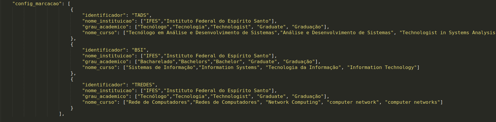
	<figcaption>Figura 15 - Configuração de marca dados  </figcaption>
</figure>

### <a name="2.2.4.8."></a> 2.2.4.8. Funcionalidade desfazer marcação de dados 

Digite o comando a seguir no Prompt de comando para desfazer a marcação dos dados das páginas coletadas. O resultado esperado está na Figura 16, uma mensagem informando o início da execução dessa funcionalidade.

```
python main.py coleta_dados marca_dados desfazer
```

<figure>
	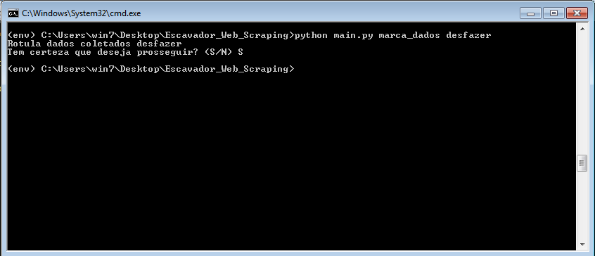
	<figcaption>Figura 16 - Funcionalidade desfazer marcação de dados  </figcaption>
</figure>


### <a name="2.2.5."></a> 2.2.5. Arquivo de configuração do Web Scraping

O arquivo de configuração deve está no mesmo diretório da pasta do programa. Veja o exemplo da sua estrutura a seguir.


```
configuracao.json
```

```
{   
    "dir_planilha": "caminho/da/planilha.csv",

    "config_marcacao": [
                        {
                            "identificador": "IDENTIFICADOR",
                            "nome_instituicao": ["nome instituicao","nome instituicao"],
                            "grau_academico": ["nome grau","nome grau"],
                            "nome_curso": ["nome curso", "nome curso"]
                        },    
                        {
                            "identificador": "IDENTIFICADOR",
                            "nome_instituicao": ["nome instituicao","nome instituicao"],
                            "grau_academico": ["nome grau","nome grau"],
                            "nome_curso": ["nome curso", "nome curso"]
                        }
                    ],

    "config_coleta":
                        {
                            "tempo_entre_pagina": 65,
                            "tempo_entre_busca": 65,
                            "pesquisar_hoje": 10,
                            "encontrado_hoje": 10
                        }

}

```

O atributo `dir_planilha` apresenta o caminho até o arquivo da planilha com os dados dos egressos, usado na etapa de carregamento inicial do banco de dados. O atributo `config_marcacao` são os dados utilizados para identificar o egresso na etapa de marcação das páginas, para este aatributo deve ser passado uma lista com itens que contém informação de cada curso (se somente um item for informado o atributo deve receber uma lista unitária). O atributo `config_coleta` contém um item que deve ser preenchidos com valores referentes ao intervalo de tempo que o programa vai esperar entre as páginas coletas, buscas realizadas, e ainda, a quantidade máxima de pesquisas que deve ser realizada na data atual e a quantidade máxima de páginas que devem se coletadas na data atual.


