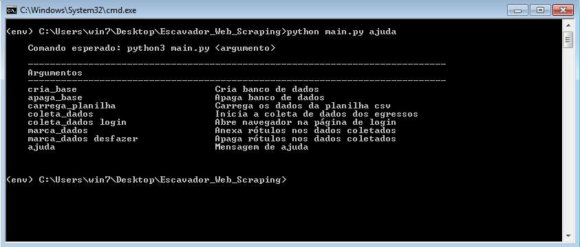

# Escavador_Web_Scraping
Escavador Web Scraping

## <a name="prototipos"></a> Sumário
+ [2.2. Manual de uso do Sistema Windows](#2.2.)
+ [2.2.1. Criação do Ambiente Virtual](#2.2.1.)
+ [2.2.2. Ativação do Ambiente Virtual](#2.2.2.)
+ [2.2.3. Adiciona variável de ambiente do banco de dados](#2.2.3.)
+ [2.2.4. Execução do programa Web Scraping](#2.2.4.)
+ [2.2.4.1. Executando funcionalidade cria base](#2.2.4.1.)


## <a name="2.2."></a> 2.2. Manual de uso do Sistema Windows


### <a name="2.2.1."></a> 2.2.1. Criação do Ambiente Virtual

Digite o comando a seguir no Prompt de comando. O resultado esperado está na Figura 1.

```
virtualenv env
```

<figure>
	
	<figcaption>Figura 1 - Prompt de Comando cria env</figcaption>
</figure>

Obs.: É preciso abrir o terminal dentro da pasta do programa. <br>
Só é necessário executar esse comando se a pasta  env não existir dentro da pasta do programa.

### <a name="2.2.2."></a> 2.2.2. Ativação do Ambiente Virtual
Digite o comando a seguir no Prompt de comando. O resultado esperado está na Figura 2.

```
env\Scripts\activate
```

<figure>
	
	<figcaption>Figura 2 - Prompt de Comando ativação env</figcaption>
</figure>

Obs.: É preciso abrir o terminal dentro da pasta do programa, mas fora da pasta env. <br>
O ambiente está ativado quando é apresentado `(env)`.

### <a name="2.2.3."></a> 2.2.3. Adiciona variável de ambiente do banco de dados

Digite o comando a seguir no Prompt de comando. O resultado esperado está na Figura 3.

```
set HOST=xxx
set DATABASE=xxx
set USER=xxx
set PASSWORD=xxx
set PORT=xxx
```

<figure>
	
	<figcaption>Figura 3 - Prompt de Comando define variável de ambiente</figcaption>
</figure>

Obs.: HOST, DATABASE, USER, PASSWORD e PORT são variáveis de ambiente para a conexão com o Banco de Dados. <br>
É preciso que o terminal esteja aberto na pasta do programa e o ambiente esteja ativado. 

### <a name="2.2.4."></a> 2.2.4. Execução do programa Web Scraping

Digite o comando a seguir no Prompt de comando para conhecer as funcionalidades do programa. O resultado esperado está na Figura 4, uma lista de argumentos que devem ser informados para ativar cada funcionalidade.

```
python main.py ajuda

```

```
    ----------------------------------------------------------------------------
    Argumento básico
    ----------------------------------------------------------------------------
    cria_base                         Cria banco de dados
    apaga_base                        Apaga banco de dados
    carrega_planilha                  Carrega os dados da planilha sem cabeçalho,
                                      ou seja, armazena a primeira linha
    coleta_dados                      Inicia a coleta de dados dos egressos
    marca_dados                       Anexa rótulos nos dados coletados
    ajuda                             Mensagem de ajuda                
    
    ----------------------------------------------------------------------------
    Argumento composto
    ----------------------------------------------------------------------------
    carrega_planilha com_cabecalho    Carrega os dados da planilha com cabeçalho,
                                      ou seja, ignora a primeira linha
    coleta_dados login                Abre navegador na página de login
    marca_dados desfazer              Apaga rótulos nos dados coletados
    
```
<figure>
	
	<figcaption>Figura 4 - Prompt de Comando conhecendo a funcionalidades do programa</figcaption>
</figure>

Obs.: O programa só vai funcionar se: o ambiente virtual estiver ativo, os pacotes dependetes do programa forem instalados, e as variáveis de ambiente forem definidas para uma banco de dados existente.  

### <a name="2.2.4.1."></a> 2.2.4.1.  Executando funcionalidade cria base


Digite o comando a seguir no Prompt de comando para criar o banco de dados. O resultado esperado está na Figura 5, uma mensagem informando o sucesso ou falha na execução dessa funcionalidade.

```
python main.py cria_base

```

<figure>
	
	<figcaption>Figura 5 - Funcionalidade cria base</figcaption>
</figure>
